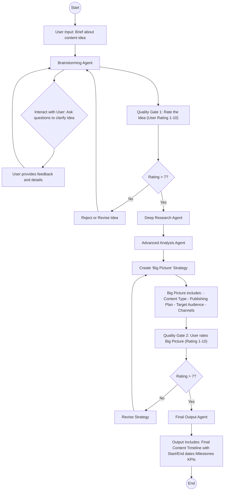

## Overview
This project implements an automated, multi-agent workflow for transforming a raw content idea into a fully-developed content strategy with validated outputs, timelines, milestones, and KPIs.

## Workflow Diagram

## Agents & Components
Agent	             Responsibility
Brainstorming Agent	 Clarifies the initial idea through interactive Q&A with the user
Deep Research Agent	 Conducts background research on the validated idea
Advanced Analysis    Agent	Analyzes research findings to inform strategy
Final Output Agent	 Generates final deliverables (content, timeline, milestones, KPIs)

## Quality Gates
Gate 1 (Idea Rating): User rates the clarified idea on a scale of 1–10.

Pass: > 7 → Proceed to research

Fail: ≤ 7 → Revise and re-enter brainstorming

Gate 2 (Strategy Rating): User rates the "Big Picture" strategy on a scale of 1–10.

Pass: > 7 → Proceed to final output

Fail: ≤ 7 → Revise strategy and re-evaluate

##Inputs
Brief description of a content idea (from user)

##Outputs
✅ Final content piece

📅 Timeline with start and end dates

🎯 Milestones

📊 KPIs for measuring success

### How to Use (Conceptual)
Submit a short content idea.

Answer clarifying questions from the Brainstorming Agent.

Rate the refined idea (must be >7/10 to continue).

The system researches and analyzes automatically.

Review the "Big Picture" strategy and rate it (>7/10 to continue).

Receive final content plan with timeline, milestones, and KPIs.
